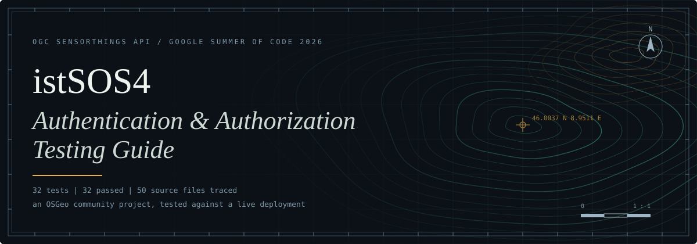

<p align="center">
  
</p>

<p align="center">
  <a href="https://kinshukss2.github.io/istSOS-Swagger-Testing-Guide/"><b>Open the guide</b></a>
  &nbsp;&middot;&nbsp;
  <a href="https://github.com/istSOS/istSOS4">istSOS4</a>
  &nbsp;&middot;&nbsp;
  <a href="https://www.ogc.org/standards/sensorthings/">OGC SensorThings API</a>
</p>

---

## Sheet metadata

| | |
|---|---|
| **Title** | istSOS4 Authentication and Authorization Testing Guide |
| **Subject** | Access control in an OGC SensorThings API server |
| **Method** | Live deployment, recorded HTTP exchanges, source tracing |
| **Result** | 32 of 32 tests passed, 0 failed, 0 manual |
| **Coverage** | 50 source files traced to the behaviour they implement |
| **Configuration** | `AUTHORIZATION=1` `NETWORK=1` `ANONYMOUS_VIEWER=0` `VERSIONING=1` `REDIS=0` |
| **Programme** | Google Summer of Code 2026 |
| **Published at** | https://kinshukss2.github.io/istSOS-Swagger-Testing-Guide/ |

## Purpose

istSOS4 stores sensor observations and serves them through the OGC SensorThings
API. Once authentication is switched on, every request is decided by who is
asking and which Network the data belongs to. A wrong decision here either leaks
observations or locks out a legitimate user.

This guide exercises that decision layer end to end against a running instance.
For every test it records what was expected, what actually came back, and which
lines of source produced the result, so a claim about access control can be
checked against both the traffic and the code.

## Legend

Each entry in the guide opens to the same five layers.

| Layer | Content |
|---|---|
| Overview | What the test checks, in plain language |
| Implementation | The source locations behind the behaviour, with line numbers |
| Test logic | The code that performs the assertion |
| Result | Expected against actual, and the verdict |
| Exchanges | The real requests and responses, replayable in Swagger |

## Map index

The tests are grouped into five sections, roughly in the order a user meets the
system.

| Section | Area | Tests |
|---|---|---|
| **S** | Ground truth: Networks, Datastreams, Observations, feature flags | S0 |
| **A** | Local account lifecycle: register, approve, log in, RBAC boundary, refresh, role change, password change, log out, reject, deactivate | A1 to A12 |
| **B** | External OIDC authentication: start login, provider consent, identity activation, provider availability | B1 to B4 |
| **C** | Data visibility and Network scoping: access matrix, anonymous denial, viewer and editor isolation, reference tables, observation counts, administrator-only policies | C1 to C10 |
| **D** | The custom role: mixed read and write grants, proving the split, revoking, external custom identities | D1 to D5 |

## Reading the page

The guide is laid out as an article rather than a dashboard.

- **Run Swagger** comes first and is always open: what Swagger is, how to start
  istSOS4, where to open it, how to authorise, how to execute a request and what
  responses to expect.
- **Test features** lists all 32 tests as cards, grouped into parts that each
  have their own colour. Each card shows the HTTP method, what was expected and
  what came back, and a *Run in Swagger* tab with the exact steps and request
  body to repeat the test.
- A **Done** checkbox on each card lets you tick a test off once you have run it.
  Ticked tests are struck through in the sidebar and the progress count is kept
  in your browser.
- Each test also has a collapsed **Implementation details** block: the
  explanation, the real source excerpts, the check that asserts it and the
  recorded request and response.
- Overview, Prerequisites, Setup, Authentication, Implementation details,
  Troubleshooting and Additional notes sit below as collapsed sections.
- Code is syntax-highlighted, can be copied, links to the exact commit on GitHub,
  and long excerpts are height-capped with a control to show them in full.
- The page uses a black theme and works down to phone width.

## Running it locally

```bash
git clone https://github.com/KinshukSS2/istSOS-Swagger-Testing-Guide.git
cd istSOS-Swagger-Testing-Guide
python3 -m http.server 8000
```

Then open `http://localhost:8000`. Opening `index.html` directly also works.

## Repository

```
.
├── index.html                the published guide, one self-contained file
├── tools/
│   ├── build.py              builds index.html
│   ├── page.html             page template and prose
│   ├── style.css             typography and layout
│   ├── app.js                accordions, copy, filter
│   └── report.source.html    generated test report used as build input
├── assets/
│   └── banner.svg            header sheet for this README
├── .nojekyll                 serve files unmodified on GitHub Pages
└── README.md
```

To rebuild after editing anything in `tools/`:

```bash
pip install beautifulsoup4 lxml
python3 tools/build.py
```

The site is served by GitHub Pages from the `main` branch and is rebuilt on
every push.

## Context

istSOS is an open-source implementation of the OGC SensorThings API, developed
in the geospatial community around SUPSI and OSGeo. This guide was prepared as
part of a Google Summer of Code project on documenting and verifying the
istSOS4 API.

---

<p align="center">
  <sub>Kinshuk &middot; <a href="https://github.com/KinshukSS2">@KinshukSS2</a></sub>
</p>
